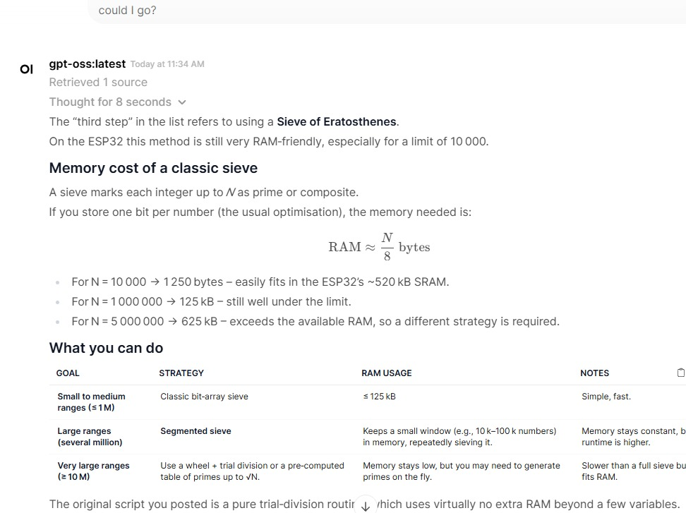

# Homeserver


Documentation on my journey to a little homelab. It currently consist of 2 routers, 1 managed switch, 3 always running servers and one LLM server that can be activated on demand:

- LLM server [server.home](#serverhome) with 22 GB GDDR5 on demand
- Raspberry Pi 4 [pi4.home](#pi4home-for-home-assistant-and-dns) for Home Assistant, DNS Resolver and filter
- Raspberry Pi 3 [pi3.home](#pi3home-for-home-assistant-and-pihole-in-secondary-network)
- [History](#history)

## server.home

This machine runs only when started manually, and is switched off most of the time. It's more a playground to see what's possible with local LLMs due to its 3 GPUs and 22 GB of fast VRAM. Other specifications:

- Intel [i3-6100](https://www.intel.com/content/www/us/en/products/sku/90729/intel-core-i36100-processor-3m-cache-3-70-ghz/specifications.html) 2C/4T 3.7 GHz Skylake
- EVGA [Z170 Classified 4-way](https://www.evga.com/support/manuals/files/151-SS-E179.pdf) motherboard with Quad-SLI, 6 PCIe slots
- RAM: 32 GB DDR4 2400 (early 2026 reduced to 16 GB)
- GPU: all NVIDIA
  - P104-100 8GB GDDR5X [314 GB/s](https://kreier.github.io/benchmark/gpu/opencl/) 5005 MHz PCIe 1.0 x4
  - GTX 1070 8GB GDDR5  [220 GB/s](https://kreier.github.io/benchmark/gpu/) 3802 MHz PCIe 3.0 x16
  - P106-100 6GB GDDR5  [176 GB/s](https://kreier.github.io/benchmark/gpu/opencl/) 4006 MHz PCIe 1.0 x16
- NVMe: 256 Toshiba PCIe 4.0 x4
- SSD: 240 Kingston SATA3 for the models of LLM used by Ollama

This image shows the 47 layers of [glm-4.7-flash](https://ollama.com/library/glm-4.7-flash):q4_K_M using 19 of the 22 GB VRAM. Each GPU has about 1 GB headroom for the K-V-pairs related to their layers when doing inference over longer context. An update of the tested maximum context length follows. 2026-02-05


### Software


As stable foundation until April 2029, and with Ubuntu Pro (ESM) until April 2034 this should be enough time to just keep this system running. Almost all other modules run in a docker container. With a fixed IP 10.10.10.40 the services get their own subdomains of server.home. It is routed with a Raspberry Pi 1B in the same network, using pihole.

- **traefik** to handle the domain names and access from the web
- **wordpress** under wp.server.home as a test wordpress installation
- **ollama** as the backbone for the llms being accessed over Open WebUI and n8n
- **Open WebUI** is accessed via llm.server.home
- **Grafana** creates beautiful visuals of the use of the server
- **n8n** tries to automate some workflows and use open APIs and LLMs in the process
- Further wordpress installations:
  - hofkoh.server.home to have an image of the old **hofkoh.de**
  - saihtorg.server.home to have an image of the old **saiht.org**
 
Over SSH I can see some details with btop and nvtop about the systems stage. And OpenWebUI renders a beautiful LLM interface that allows to upload documents and rendered LaTeX output, structured text and tables



### Docker

I was surprizes how simple the setup with docker is. Inside your home folder you create a folder `/docker` and for each container a subfolder, for example `~/docker/wordpress`. Then you put a YAML `docker-compose.yml` file in there that describes services (db, wordpress), volumes and networks. For a first start you need

``` sh
docker compose up -d
docker compose down
docker restart traefik
``` 

You can also forward instructions into the docker container, or open a console in it:

``` sh
docker exec -it ollama ollama run mistral --verbose
docker exec -it ollama bash
```

Don't forget to create your network:

```sh
docker network create my_network
docker network ls
```


### Traefik and SSL/TLS

Now I have a root certificate for server.home. Once it is imported, all the other sites as subdomains are trusted with the wildcard *.server.home certificate. All network traffic even inside the local network is therefore encrypted.

Link to certificate: 

## 8500.home

Technically it is an i5-8500T processor inside the HP EliteDesk mini 800 G4 with 2 NVMe slots inside. The motivation was not just size, but the power consumption of just 4 Watt when idle. And homeservers are idle most of the time, why waste a lot of electricity. It has a separate network and is actually connected to the internet to n8n.io.vn or c103.io.vn

### Hardware

- i5-8500T
- 32 GB DDR4 2400 MT/s with 
- NVMe PCIe 4.0 x4 512 GB
- USB Network 2.5 GB

### Software

There was a lot to learn about the several layers of abstraction. Here is a little table as visual vertical block:

| Level | Layer | Component | Function |
| :--- | :--- | :--- | :--- |
| **0** | **Physical** | HP EliteDesk 800 G4 (i5-8500T) | The "Bare Metal" hardware and raw silicon. |
| **1** | **Hypervisor** | Proxmox VE | Type-1 Hypervisor managing hardware resources. |
| **2** | **Virtual OS** | Ubuntu 24.04.3 LTS | The Guest VM with its own kernel and file system. |
| **3** | **Container Engine** | Docker & Docker Compose | The runtime that isolates apps from the OS. |
| **4** | **Routing** | Traefik | The "Front Door" that handles SSL and traffic. |
| **5** | **Applications** | WordPress, Ollama, Home Assistant | The specific services providing data and logic. |

With the UHD 630 we can even use the GPU to support ollama: You will need to "Pass-through" the GPU device from Proxmox (Level 2) $\rightarrow$ Ubuntu (Level 3) $\rightarrow$ Docker (Level 4) so that Ollama (Level 5) can use it.

## pi4.home for Home Assistant and DNS

I would like to have a few unique domain names for different services, maybe subdomains. That's not supported by my Asus router RT-AX55. I can only get a `pi4.home` assigned to a predetermined IP, further parts could possibly be done with `traefik` and subfolders. But better to have a dedicated DNS server. Here is where the Raspberry Pi 4 steps in.

Traefik is forwarding incoming requests to the right container, but getting a DNS entry is another question. With Pihole I also get a great AD blocker. Its surprizing that about 25% of all DNS requests have to be blocked!

### Pihole AD blocker and DNS server

It's nice to have a graphical interface. It just took a little longer to get the service running on 10.10.10.4/admin over http to be accepted locally on https://pi4.hv.io.vn/admin with a valid certificate. But it works now!

### n8n.hv.io.vn to automate things

It is just an attempt to use this tool. Maybe some extra accounts will help to not have this spread out.

### ai.hv.io.vn

This is where the fontend of Open WebUI responds to my requests, in the backbone it connects to the ollama server. It might first have to power it up, but after less than 60 seconds the machine is ready.

### OpenClaw
 This would be reckless, but I'm curious nonetheless. The old Clawdbot made some waves end 2025 and early 2026. What can we actually build?

### ha2.hv.io.vn

This is in my own network, all Wifi sensors in my home run on the other network. But I can connect to some Bluetooth temperature and humidity sensor and show it on the info panel. And toner status of the laser printer.

## pi3.home for Home Assistant and Pihole in secondary network

The network for gadgets and devices I don't know a lot about.

## History

### 2024

I started to build my own LLM server, and I knew already that I need a lot of RAM and processing power. So I got a used [Xeon E5-2696v3](https://www.techpowerup.com/cpu-specs/xeon-e5-2696-v3.c2903) 18C/36T and 128 GB ECC RAM. It fit's larger models like the llama3.1:70b but comes to a crawl of **only 0.2 token/s** since I only have [8.27 GB/s](https://github.com/kreier/benchmark/tree/main/gpu/opencl) memory bandwidth. The i5-8500 would probably get 34 GB/s and speed up to 1 token/s.

**In 2026** I realized that there must be a glitch. The model stated above was the llama3.1:70b with 4 bit quantization. The download is 39 GB, and it used 42 GB RAM with ollama. The smaller llama3.1:70b-instruct-q3_K_M is only 34 GB in download and uses 38 GB RAM. Yet here I get a much faster 0.83 token/s speed. Assuming linear dependency on model size and memory speed this aligns with all other measurements (30GB, 19GB, 12GB, 8GB) of the E5-2696 v3. The comparison below should therefore assume 0.74 as reference, 4.6x faster and relating to 38 GB/s memory speed. Being quad-channel of up to 68 GB/s this is more in line with the expectation. The P104-100 would still be 10x faster!

### 2025

GPUs do not only posess a lot of parallel compute power (important for the initial **PP** - prompt processing for an LLM task) but usually also have a fast memory. My P104-100 for example has [314 GB/s](https://github.com/kreier/benchmark/tree/main/gpu/opencl) memory bandwidth for the 8 GB of GDDR5X RAM, that's 38x faster than the DDR3 ECC RAM. Which would result in ca. 7.6 token/s for the [llama3.1:70b model](https://ollama.com/library/llama3.1) in 4bit quantization, requiring 43 GB (that I don't have). And since the GPUs require a lot of power, they also get hot. My Z170 would support 4 graphics cards, but using only 2 slots per GPU is actually rather narrow. It is better to have one slot empty space for airflow between them. But then you can only fit 3 GPUs on the motherboard:

 

The GTX 1060 has a broken HDMI port, but I still can use the 3 DP to connect a display. So I moved it to my E3-1226 v3 machine. I lost 6 GB VRAM of the combined 26 GB. Then one P106-100 broke, so I replaced it with a P104-100. **More memory**, and much **faster**! Now 2 GB more and with 320 GB/s bandwidth. That is the machine that is now running. The theoretical power consupmtion of the three GPUs is 180W + 150W + 120W = 450W but in reality during inference and prompt processing they only use 150W.

| GPU      | power old | power new | GB/s |
|----------|:-----:|:-----:|:----:|
| 3060 Ti  |  200  |       |  448 |
| P106-100 |  120  |  120  |  192 |
| P106-100 |  120  |       |  192 |
| GTX 1060 |  120  |       |  192 |
| GTX 1070 |       |  150  |  256 |
| P104-100 |       |  180  |  320 |
| total    |  560  |  450  |      |

### 2026

With more time in training models the available modesl also get significantly better. Now I can use a [19GB glm-4.7-flash](https://ollama.com/library/glm-4.7-flash) that DOES fit into the **22 GB VRAM,** distributed over my 3 GPUs (all 47 layers). The speed should now be 17.2 token/s if we use a linear approach (or 12 resp. 10 for the slower 1070 and P106). Effectively I get 23 token/s in Open WebUI, probably due to being a MoE model to effectively double the speed again (see my insight on [speculative execution](https://kreier.github.io/ml/#faster-inference-with-speculative-execution) from 2024-11-27)

Now I finally have a usable system. I get **23 token/s** instead of theoretically only 7.6 token on llama3.1:70b (3x as fast) while also getting a similar or better result:

| Benchmark                | Llama 3.1 70B (Instruct) | GLM-4.7-Flash | Winner        |
|--------------------------|--------------------------|---------------|---------------|
| MMLU (General Knowledge) | ~84.0% (5-shot)          | ~81.2%        | Llama 3.1 70B |
| GSM8K (Math Reasoning)   | ~94.8%                   | ~89.5%        | Llama 3.1 70B |
| HumanEval (Coding)       | ~79.3%                   | ~82.4%        | GLM-4.7-Flash |

There are a few models that fit into the 22 GB:

- 19 GB [glm-4.7-flash](https://ollama.com/library/glm-4.7-flash) with MoE and reasoning
- 17 GB [translategemma:27b](https://ollama.com/library/translategemma) for 55 languages, maybe [timeline project](https://github.com/kreier/timeline)?
- 20 GB [qwen3-vl:30b](https://ollama.com/library/qwen3-vl) vision-language model in the Qwen family

A short chat wit Gemini revealed that to fully use the context window of 198K one need 40.5 GB VRAM, even though the model weights are only 15 GB. That's because the KV Cache needs 0.12 GB per 1k tokens in the MLA architecture. Maybe I should investigate that with a few longer text documents, since my available VRAM has been reduced by 4 GB in 2026, while also reducing the power consumption from 560W to 450W. The last GPU was only connected PCIe 1.0 x1 anyway (0.25 GB/s vs. 16 GB/s for 3.0 x16).

| year |    GPU   |  RAM  | GB/s |
|:----:|:--------:|:-----:|:----:|
| 2023 |    M1    |  8 GB |   68 |
| 2024 |  3070 Ti |  8 GB |  608 |
| 2025 | P106-100 | 26 GB |  192 |
| 2026 | P104-100 | 22 GB |  320 |
